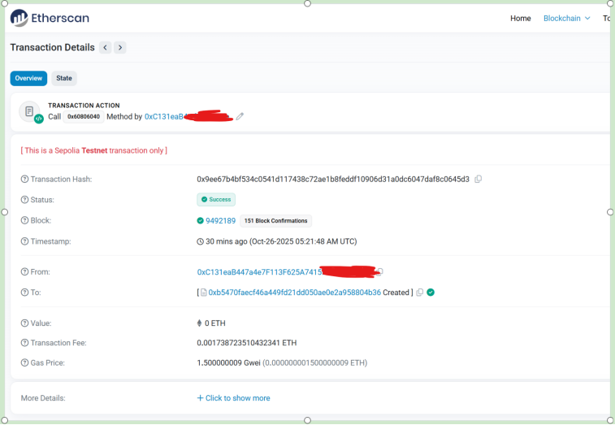
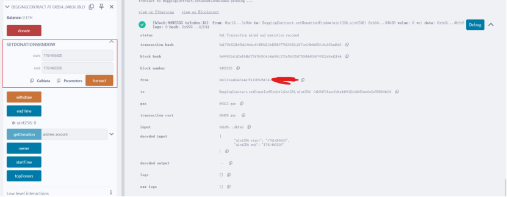
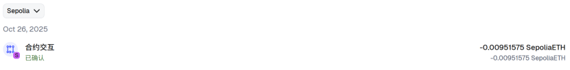
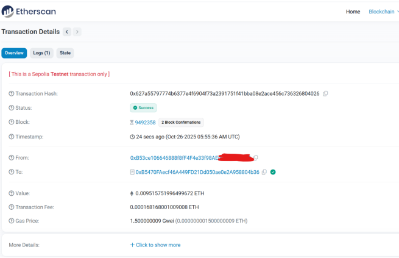
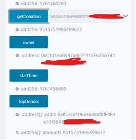
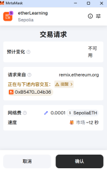

# solidity_homework
This repository is for learning Solidity and uploading homework.

## Project Structure

This repo follows a structure similar to OpenZeppelin for clarity:

- `contracts/` — Solidity sources
  - `interfaces/` — Public interfaces (ABIs)
  - `utils/` — Reusable libraries and helpers
    - `strings/` — `StringUtils.sol`, `RomanNumerals.sol`
  - `token/` — Add `erc20/`, `erc721/` here if you implement tokens
  - `access/` — Access control helpers (add if needed)
  - `mocks/` — Example/demo contracts for testing
- `test/` — Place tests here (Hardhat/Foundry/etc.)
- `scripts/` — Utility scripts (deploy, verify)
- `deploy/` — Deployment configs or scripts
- `docs/` — Documentation and notes

BeggingContract Result
- 合约签署：
- 合约地址：0xb5470faecf46a449fd21dd050ae0e2a958804b36

- 设置合约接收捐赠的开始和结束时间：2025-10-26 13：30 - - 2025-10-26 14：30 

- 使用另外一个账户给合约发钱 

- 合约内参数 

- 讨饭合约主提款跑路 
